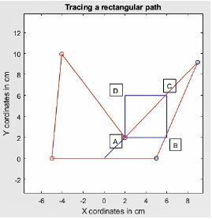

# Trajectory-Generation-using-Inverse-Kinematics

## Introduction
The major advantage of DexTAR over a serial SCARA comes from the placement of motors. As the motors are placed at the base the moving links can be much lighter than a SCARA robot. Due to lighter moving parts and lower inertia with respect to serial manipulators, it can reach high speeds, and is extremely precise. Since there are two links connected to the end effector it has more rigidity compared to a two link serial manipulator and thus has more strength. This without a doubt increases its payload capacity over its serial counterpart.
The DexTAR robot is driven by just two actuators at the base has lesser restrictions compared to other parallel robots like the Delta robot. As a result of this, it has more workspace. In Fig.1 one can see the workspace available represented by the black oval region. Furthermore as DexTAR uses equal link lengths it has most optimal workspace when compared to other five bar robots.

Formulation of Forward Kinematics, Inverse Kinematics, Jacobian, Inertia matrix and Mass Matrix of a five bar parallel planar manipulator.

## Singularities
A two link serial manipulator has only one kind of singularity where the end effector loses one degree of freedom. This happens when the arm is fully stretched or fully folded. In case of DexTAR, and any parallel robot in general, there are two kinds of singularities

### Type 1 Singularity
Type I singularities are commonly referred to as serial singularities, and are common to both parallel and serial manipulators. In this case the end effector loses one or several degrees of freedom.

### Type 2 Singularity
Type II singularities are referred to as parallel singularities and are common in parallel robots. Here the actuators are not capable of resisting a force/moment applied to the end effector. They also lead to segmentation of the workspace into various singularity–free regions.

## Modes of operation
To eliminate the Type 2 singularity mentioned above, the concept of switching modes is used. The modes as shown Fig. 5. Modes of operation in Figure 4 definite workspaces which are singularity free. This fact can be utilised to map different geometries and trace different paths without encountering the singularity. If our task space overlaps between two or more such singularity free zones, the approach is to switch between the appropriate working modes.

## Trajectory Generation
In the previous sections we have already calculated the inverse kinematics for the model. So for a given end effector position we know the angles theta1 and theta2 for our actuator input. As there can be multiple solutions for the given end effector position we can have different values of our actuator inputs theta1 and theta2. But for the purpose of obtaining trajectories we will make some assumptions with respect to the kind of configuration we want to be working with.

A. Tracing a Line
Assembly mode: Positive
Working mode: (+) (+)
Equation of line: y= x+10

B. Tracing a Rectangle
Assembly mode: Negative
Working mode: (-)(+)
Corner points of rectangle: {(2,2),(6,2),(6,6),(2,6)} in the
order ABCD

Tracing a Circle
Assembly mode: Positive
Working mode: (-)(+)
Centre: (0,15)
Radius: 3 cm

Tracing an Involute Spiral
Assembly mode: Positive
Working mode: (-)(+)
Centre : (0,15)

## Conclusions
The five bar equal length parallel manipulator DexTAR was studied in detail. The forward kinematics and inverse kinematics equations, jacobian and the formulations for Inertia matrix (Joint Space) and Mass Matrix (Cartesian space) were calculated. The use of equal link lengths makes optimal use of workspace and is free of any holes, but has the drawback of more singularities, and
hence reduced degrees of freedom in such scenarios. Using the concept of modes of operation and associated singularity free zones, the end effector position could be traced along four different paths using a MATLAB script without encountering any Type II singularities.
